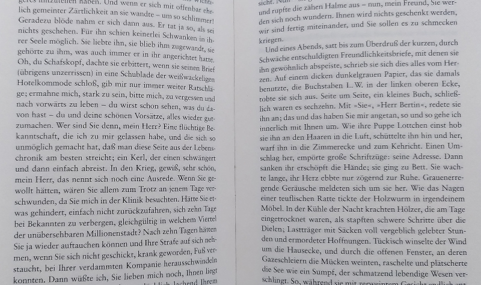
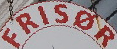
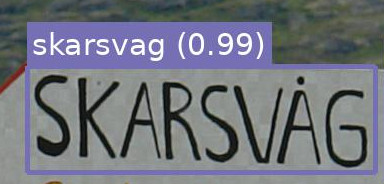
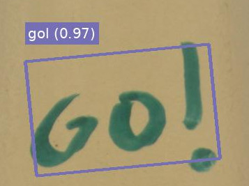
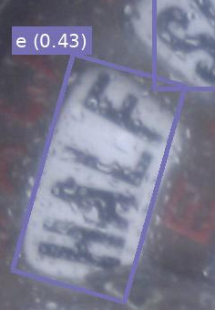
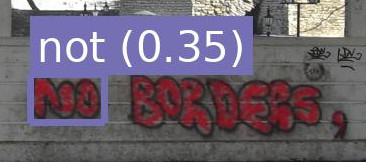
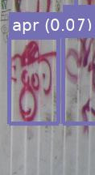

# Photo OCR

Read text in photos / images with complex backgrounds with this easy-to-use Python library.


```python
from PIL import Image
from photo_ocr import ocr, draw_ocr_results

image = Image.open("images/pub.jpg")

# run the ocr
results = ocr(image)
print(results)

# draw bounding polygons and text on the image
image = draw_ocr_results(image, results)

# done!
image.save("images/pub_annotated.jpg")
```

## Table of contents

1. [Introduction](#section-introduction)
2. [Installation](#section-installation)
3. [Usage](#section-usage)
4. [Troubleshooting](#section-troubleshooting)

## <a id="section-introduction">1. Introduction</a>


### How is this different to tesseract / other OCR tools?

Classic OCR tools like [tesseract](https://github.com/tesseract-ocr/tesseract) work best with scans of book pages / documents. A lot of
manual image pre-processing is needed to get useful results out of these tools
when running them on images that do not contain black-on-white text. In
this case it is best to use tools that specialise on so-called "Scene
text recognition" (e.g. photo_ocr).


|Classic OCR (e.g. tesseract)| Scene text recognition (e.g. photo_ocr) |
--- | --- |
|||
|Black text on white background, standard font, layout matters (lines / paragraphs / columns). | Large variation in fonts, font sizes, colours, angles. Mostly individual words, no consistent layout.|


### How does it work?

photo_ocr processes an image in three stages:

| <div style="width:200px">1. Text detection </div> | <div style="width:200px">2. Cropping</div> | <div style="width:200px">3. Text recognition </div>| 
:---: | :---: | :---: |
 |  <br/>  <br/>| <br/> erisox (0.08, fail!), <br/> <br/>cheri (0.97),<br/><br/>solstudio (0.94) |
Find bounding polygons around words | Crop and align horizontally | "Reading" the text from the cropped images |

### Which models are supported?

photo_ocr is a wrapper around deep learning models kindly open-sourced by [Clova.ai](https://clova.ai).

For text detection, photo_ocr uses the CRAFT text detection model ([paper](https://arxiv.org/pdf/1904.01941.pdf), [original source code](https://github.com/clovaai/CRAFT-pytorch)). CRAFT 
has been released under MIT license (see file [LICENSE_detection](LICENSE_detection)). 

For text recognition, photo_ocr uses the models released in the Clova.ai text recognition
model benchmark ([paper](https://arxiv.org/pdf/1904.01906.pdf), [original source code](https://github.com/clovaai/deep-text-recognition-benchmark)).
This collection of models has been released under Apache license (see file
[LICENSE_recognition](LICENSE_recognition)). 


### Which languages are supported?

The models have been trained on __English__ words, but
work well also for other languages that use a __latin alphabet__ (see xx for known issues). 
Other alphabets are currently not supported by photo_ocr.


## <a id="section-installation">2. Installation</a>

photo_ocr works with Python>=3.6, todo pytorch/torchvision version.

```
pip install photo_ocr
```

All __models are automatically downloaded__ the first time they are needed. The
models are stored locally in the standard pytorch model directory, which
you can change by setting the `TORCH_HOME` environment variable (see the [official pytorch documentation](https://pytorch.org/docs/stable/hub.html) for details).

## <a id="section-usage">Usage</a>

(You can find a script containing all the snippets below at [example.py](example.py))

### Input

The library takes as input a [pillow / PIL](https://pillow.readthedocs.io/en/stable/) image.

You can use PIL directly to read the image from file.

```python
from PIL import Image
image = Image.open("images/pub.jpg")
```
For convenience, photo_ocr also offers a `load_image` function, which
opens the image and rotates it according to the EXIF metadata, if necessary.

```python
from photo_ocr import load_image
image = load_image("images/pub.jpg")
```
### Running the OCR

Just one simple function call to the `ocr` function:

```python
from photo_ocr import ocr

results = ocr(image)
```

The `ocr` function returns a list of all text instances found
in the image. The list is sorted by recognition confidence, 
starting with the most confident recognition. 

You can loop over the results like this:

```python
for result in results:
    # polygon around the text
    # (list of xy coordinates: [(x0, y0), (x1, y1),  ....])
    print(result.polygon)
    
    # the actual text (a string)
    print(result.word)
    
    # the recognition confidence (a number in [0.0, 1.0])
    print(result.confidence)
```

Since each entry in the results list is a`namedtuple`, you can
also loop over the results like this: 

```python
for polygon, word, confidence in results:
    print(polygon)
    print(word)
    print(confidence)
```

### Visualising the results

Use the `draw_ocr_results` method to draw the
recognition results onto the original image. 

```python
from photo_ocr import draw_ocr_results

image = draw_ocr_results(image, results)
image.save("images/pub_annotated.jpg")
```

### Running only text detection

Use the `detection` function to only run the text detection step:

```python
from photo_ocr import detection

# list of polygons where text was found
polygons = detection(image)

for polygon in polygons:
    # polygon around the text
    # (list of xy coordinates: [(x0, y0), (x1, y1),  ....])
    print(polygon)
```

You can also use `draw_ocr_results` function to draw the
results of the `detection`:

```python
from photo_ocr import draw_ocr_results

image = draw_ocr_results(image, polygons)
image.save("images/pub_detections.jpg")
```

### Running only text recognition

Use the `recognition` function to only run the text recognition step.
You need to supply an image that has already been cropped to a
text polygon. The text should be aligned horizontally. 

```python
from photo_ocr import load_image, recognition

crop = load_image("images/crop0.png")

text, confidence = recognition(crop)
```

### Running multiple images

You can also run the `ocr`, `recognition`, `detection` functions on
a list of images instead of a single image:


```python
from photo_ocr import load_image, ocr, draw_ocr_results


images = [load_image("images/pub.jpg"), 
          load_image("images/stickers.jpg"),
          load_image("images/hairdresser.jpg")]

all_results = ocr(images)

for image, results_for_image in zip(images, all_results):
    image = draw_ocr_results(image, results_for_image)
    image.save("some_filename.jpg")
```

## <a id="section-parameters">Detailed configuration / parameters </a>


## <a id="section-troubleshooting">Troubleshooting</a>


| Example | Description |  Reason | Solution | 
:---: | :--- | :--- | :--- |
 | Special letters (e.g. å, ö, ñ) are not recognized properly | The models have been trained on latin letters only. In most cases, the recognition still works well, with the model using similar-looking substitutes for the special letters. | Use a spellchecker after running text recognition to get the correct letters. |
 | Special characters (e.g. !, ?, ;) are not recognized properly | The default text recognition model supports only the characters a-z and 0-9. | Switch to the case-sensitive model, which also supports 30 common special characters. (see ....)
  | Text area is found, but text recognition returns only one-letter results (e.g. e, i, a) | The angle of the text is so steep, that the crop is being rotated in the wrong direction. | Rotate the input image by 90°. |
  | Text area is not found. | - | Try decreasing the confidence_threshold. If this does not help, decrease the text_threshold_first_pass and text_threshold_second_pass. |
  | Text area is found but there is no text. | - | Try increasing the confidence_threshold. If this does not help, increase the text_threshold_first_pass and text_threshold_second_pass.  |

