# Photo OCR

Read text in photos / images with complex backgrounds with this easy-to-use Python library.

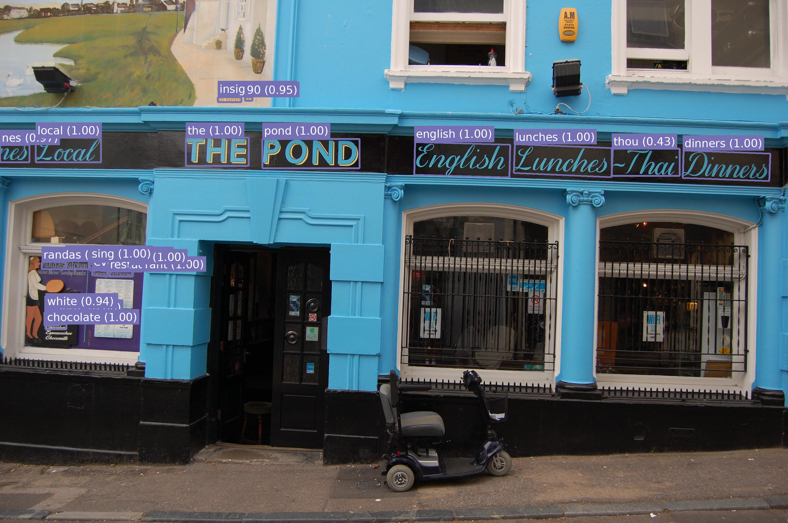

```python
from PIL import Image
from photo_ocr import ocr, draw_ocr

# (download pub.jpg here: https://github.com/krasch/photo_ocr/blob/master/pub.jpg)
image = Image.open("pub.jpg")

# run the ocr
results = ocr(image)
print(results)

# draw bounding polygons and text on the image
image = draw_ocr(image, results)

# done!
image.save("pub_ocr.jpg")
```

## Table of contents

1. [Introduction](#section-introduction)
2. [Installation](#section-installation)
3. [Usage](#section-usage)
4. [Troubleshooting](#section-troubleshooting)
5. [Detailed configuration / parameters](#section-parameters)


## <a name="section-introduction">1. Introduction</a>


### How is this different to tesseract / other OCR tools?

Classic OCR tools like [tesseract](https://github.com/tesseract-ocr/tesseract) work best with scans of book pages / documents. A lot of
manual image pre-processing is needed to get useful results out of these tools
when running them on images that do not contain black-on-white text. In
this case it is best to use tools that specialise on so-called "Scene
text recognition" (e.g. photo_ocr).


|Classic OCR (e.g. tesseract)| Scene text recognition (e.g. photo_ocr) |
--- | --- |
|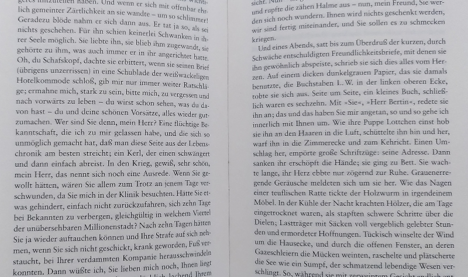|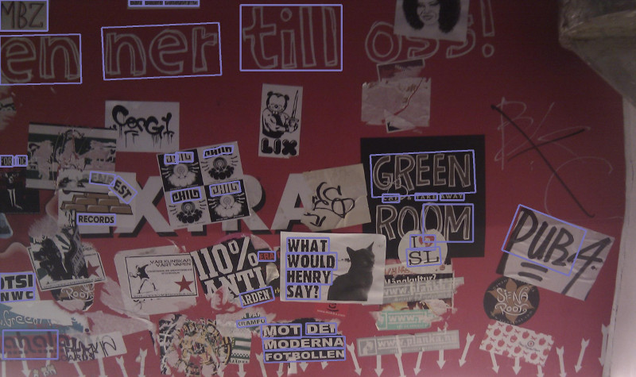|
|Black text on white background, standard font, layout matters (lines / paragraphs / columns). | Large variation in fonts, font sizes, colours, angles. Mostly individual words, no consistent layout.|


### How does it work?

photo_ocr processes an image in three stages:

| <div style="width:200px">1. Text detection </div> | <div style="width:200px">2. Cropping</div> | <div style="width:200px">3. Text recognition </div>| 
:---: | :---: | :---: |
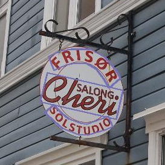 | 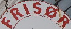 <br/>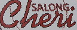  <br/>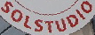| <br/> erisox (0.08, fail!), <br/> <br/>cheri (0.97),<br/><br/>solstudio (0.94) |
Find bounding polygons around words | Crop and align horizontally | "Reading" the text from the cropped images |

### Which models are supported?

photo_ocr is a wrapper around deep learning models kindly open-sourced by [Clova.ai](https://clova.ai).

For text detection, photo_ocr uses the CRAFT text detection model ([paper](https://arxiv.org/pdf/1904.01941.pdf), [original source code](https://github.com/clovaai/CRAFT-pytorch)). CRAFT 
has been released under MIT license (see file [LICENSE_detection](LICENSE_detection)). 

For text recognition, photo_ocr uses the models released in the Clova.ai text recognition
model benchmark ([paper](https://arxiv.org/pdf/1904.01906.pdf), [original source code](https://github.com/clovaai/deep-text-recognition-benchmark)).
This collection of models has been released under Apache license (see file
[LICENSE_recognition](LICENSE_recognition)). 


### Which languages are supported?

The models have been trained on __English__ words, but
work well also for other languages that use a __latin alphabet__ (see xx for known issues). 
Other alphabets are currently not supported by photo_ocr.


## <a name="section-installation">2. Installation</a>

photo_ocr works with Python>=3.6, todo pytorch/torchvision version.

```
pip install photo_ocr
```

All __models are automatically downloaded__ the first time they are needed. The
models are stored locally in the standard pytorch model directory, which
you can change by setting the `TORCH_HOME` environment variable (see the [official pytorch documentation](https://pytorch.org/docs/stable/hub.html) for details).

## <a name="section-usage">3. Usage</a>

(You can find a script containing all the snippets below at [example.py](https://github.com/krasch/photo_ocr/blob/master/example.py))

### Input

The library takes as input a [pillow / PIL](https://pillow.readthedocs.io/en/stable/) image.

You can use PIL directly to read the image from file.

```python
from PIL import Image

# (download pub.jpg here: https://github.com/krasch/photo_ocr/blob/master/pub.jpg)
image = Image.open("pub.jpg")
```
For convenience, photo_ocr also offers a `load_image` function, which
opens the image and rotates it according to the EXIF metadata, if necessary.

```python
from photo_ocr import load_image

image = load_image("pub.jpg")
```
### Running the OCR

Just one simple function call to the `ocr` function:

```python
from photo_ocr import ocr

results = ocr(image)
```

The `ocr` function returns a list of all text instances found
in the image. The list is sorted by recognition confidence, 
starting with the most confident recognition. 

You can loop over the results like this:

```python
for result in results:
    # polygon around the text
    # (list of xy coordinates: [(x0, y0), (x1, y1),  ....])
    print(result.polygon)
    
    # the actual text (a string)
    print(result.text)
    
    # the recognition confidence (a number in [0.0, 1.0])
    print(result.confidence)
```

Since each entry in the results list is a`namedtuple`, you can
also loop over the results like this: 

```python
for polygon, text, confidence in results:
    print(polygon)
    print(text)
    print(confidence)
```

### Visualising the results

Use the `draw_ocr` method to draw the OCR results onto the original image.

```python
from photo_ocr import draw_ocr

image = draw_ocr(image, results)
image.save("pub_ocr.jpg")
```

### Running only text detection

Use the `detection` function to only run the text detection step:

```python
from photo_ocr import detection

# list of polygons where text was found
polygons = detection(image)

for polygon in polygons:
    # polygon around the text
    # (list of xy coordinates: [(x0, y0), (x1, y1),  ....])
    print(polygon)
```

You can use the `draw_detections` function to draw the
results of the `detection`:

```python
from photo_ocr import draw_detections

image = draw_detections(image, polygons)
image.save("pub_detections.jpg")
```

### Running only text recognition

Use the `recognition` function to only run the text recognition step.
You need to supply an image that has already been cropped to a
text polygon. The text should be aligned horizontally. 

```python
from photo_ocr import load_image, recognition

# (download crop.jpg here: https://github.com/krasch/photo_ocr/blob/master/crop.jpg)
crop = load_image("crop.jpg")

text, confidence = recognition(crop)
```

## <a name="section-troubleshooting">4. Troubleshooting</a>


| Example | Description |  Reason | Solution | 
:---: | :--- | :--- | :--- |
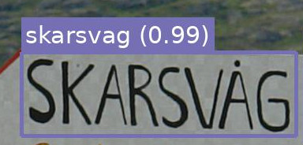 | Special letters (e.g. å, ö, ñ) are not recognized properly | The models have been trained on latin letters only. In most cases, the recognition still works well, with the model using similar-looking substitutes for the special letters. | Use a spellchecker after running text recognition to get the correct letters. |
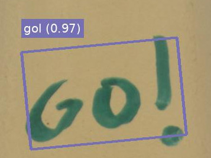 | Special characters (e.g. !, ?, ;) are not recognized properly | The default text recognition model supports only the characters a-z and 0-9. | Switch to the <a href="#param-model">case-sensitive model</a>, which also supports 30 common special characters. 
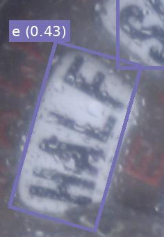  | Text area is found, but text recognition returns only one-letter results (e.g. e, i, a) | The angle of the text is so steep, that the crop is being rotated in the wrong direction. | Rotate the input image by 90°. |
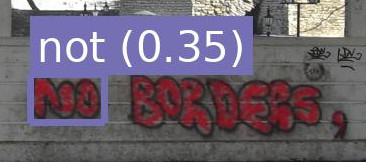  | Text area is not found. | - | Try decreasing the <a href="#param-confidence_threshold">confidence threshold</a>. Alternatively, decrease the <a href="#param-text_threshold_first_pass">text_threshold_first_pass</a> and <a href="#param-text_threshold_second_pass">text_threshold_second_pass</a>. |
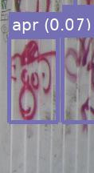  | Text area is found where there is no text. | - | Try increasing the  <a href="#param-confidence_threshold">confidence threshold</a>. Alternatively, increase the <a href="#param-text_threshold_first_pass">text_threshold_first_pass</a> and <a href="#param-text_threshold_second_pass">text_threshold_second_pass</a>.  |


## <a name="section-parameters">5. Detailed configuration / parameters </a>


### Runtime parameters

| Name | Description |  Values | 
:--- | :--- | :--- 
<a name="param-confidence_threshold">confidence_threshold</a> | Only recognitions with confidence larger than this threshold will be returned. | a float in [0.0, 1.0), default=0.3


```python

results = ocr(image, confidence_threshold=0.3)
```


### Initialisation parameters

For convenience, the `ocr`, `detection`, `recognition` methods
are pre-initialised with sensible defaults. If you want to change any of these parameters, you 
need to initialise these methods again with your own settings (see [initialisation code](#section-initialisation-code)).

##### Detection params

| Name | Description | Values |
:--- | :--- | :--- 
<a name="param-image_max_size">image_max_size</a> | During image pre-processing before running text detection, the image will be resized such that the larger side of the image is smaller than image_max_size. | an integer, default=1280
<a name="param-image_magnification">image_magnification</a> | During image pre-processing before running text detection, the image will be magnified by this value (but no bigger than image_max_size) | a float &ge; 1.0, default=1.5
<a name="param-combine_words_to_lines">combine_words_to_lines</a> | If true, use the additional "RefineNet" to link individual words that are near each other horizontally together.| a boolean, default=False|
<a name="param-text_threshold_first_pass">text_threshold_first_pass</a> | The CRAFT model produces for every pixel a score of howlikely it is that this pixel is part of a text character (called regions score in the paper). During postprocessing, only those pixels are considered, that are above the text_threshold_first_pass. | a float in [0.0, 1.0], default=0.4 | 
<a name="param-text_threshold_second_pass">text_threshold_second_pass</a> | See explanation of text_threshold_first_pass. During postprocessing, there is a second round of thresholding happening after the individual characters have been linked together to words (see link_threshold); detection_text_threshold_second_pass <= detection_text_threshold_first_pass| a float in [0.0, 1.0], default=0.7|
<a name="param-link_threshold">link_threshold</a> | The CRAFT model produces for every pixels a score of how likely it is that this pixel is between two text characters (called affinity score in the paper). During postprocessing, this score is used to link individual characters together as words.| a float in [0.0, 1.0], default=0.4|

##### Recognition params

| Name | Description | Values |
:--- | :--- | :--- 
<a name="param-model">model</a> | Which recognition model to use, see the [paper](https://arxiv.org/pdf/1904.01906.pdf), in particular Figure 4. <br/><br/> Best performance: TPS_ResNet_BiLSTM_Attn <br/><br/>slightly worse performance but five times faster: model_zoo.None_ResNet_None_CTC <br/><br/>case-sensitive: model_zoo.TPS_ResNet_BiLSTM_Attn_case_sensitive| One of the initialisation functions in the photo_ocr.recognition.model_zoo, default=model_zoo.TPS_ResNet_BiLSTM_Attn |
<a name="param-image_width">image_width</a> | During image pre-processing, the (cropped) image will be resized to this width models were trained with width=100, other values don't seem to work as well | an integer, default=100|
<a name="param-image_height">image_height</a> | During image pre-processing, the (cropped) image will be resized to this height;  models were trained with height=32, other values don't seem to work as well | an integer, default=32|
<a name="param-keep_ratio">keep_ratio</a> | When resizing images during pre-processing: True -> keep the width/height ratio (and pad appropriately) or False -> simple resize without keeping ratio| a boolean, default=False| 


##### <a name="section-initialisation-code">Initialisation code<a>

```python

from photo_ocr import PhotoOCR
from photo_ocr.recognition import model_zoo 


detection_params = {"image_max_size": 1280,
                    "image_magnification": 1.5,
                    "combine_words_to_lines": False,
                    "text_threshold_first_pass": 0.4,
                    "text_threshold_second_pass": 0.7,
                    "link_threshold": 0.4}

recognition_params = {"model": model_zoo.TPS_ResNet_BiLSTM_Attn,
                      "image_width": 100,
                      "image_height": 32,
                      "keep_ratio": False}

# initialise the photo_ocr object
photo_ocr = PhotoOCR(detection_params, recognition_params)

# optionally: make class methods available as global functions for convenience
ocr = photo_ocr.ocr
detection = photo_ocr.detection
recognition = photo_ocr.recognition
```