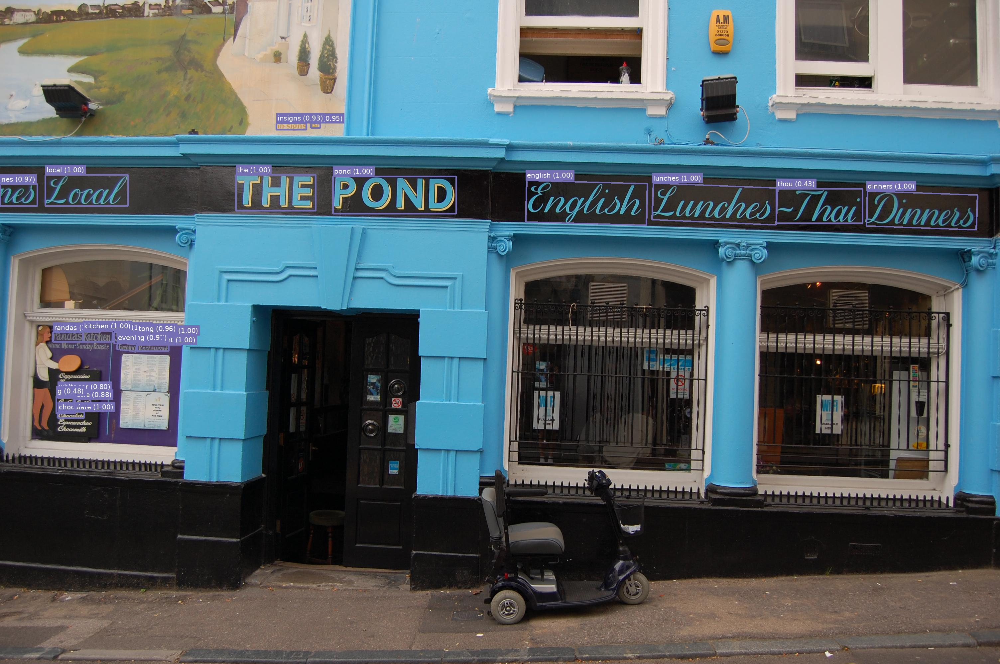

# Photo OCR

Read text in photos / images with complex backgrounds with this easy-to-use Python library.




```python
from PIL import Image
from photo_ocr import ocr
image = Image.open("examples/rifles.png")
text = ocr(image)
```


### How is this different to tesseract / other OCR tools?

|Classic OCR (e.g. tesseract)| Scene text recognition (e.g. photo_ocr) |
--- | --- |
|  [Photo by Craig Howell](https://www.flickr.com/photos/seat850/6845895200/)||
|Black text on white background, standard font, layout matters| Large variation in fonts, font sizes, colours, angles. Mostly individual words, no consistent layout.|

### How does it work?

photo_ocr is a wrapper around two deep learning models kindly open-sourced by Clova.ai. photo_ocr
processes an image in three stages:


Stage | Example | Supported models | 
--- | --- | --- |
|__Text detection__| image here| CRAFT text detection model ([paper](https://arxiv.org/pdf/1904.01941.pdf), [original source code](https://github.com/clovaai/CRAFT-pytorch))
|__Cropping and alignment__| image here| (no model needed)
|__Text recognition__| image here|


two deep learning models kindly open-sourced by [Clova.ai](https://clova.ai)

The __CRAFT text detection__ model ([paper](https://arxiv.org/pdf/1904.01941.pdf), [original source code](https://github.com/clovaai/CRAFT-pytorch)) finds text
regions in images. It 


## Installation


```
pip install photo_ocr
```


#### Getting the models

All models are automatically downloaded the first time they are needed. You
don't need to do anything.

todo manual download

## Usage

# How to?

```
git clone https://github.com/krasch/photo_ocr.git
pipenv install
pipenv shell
python example.py
```